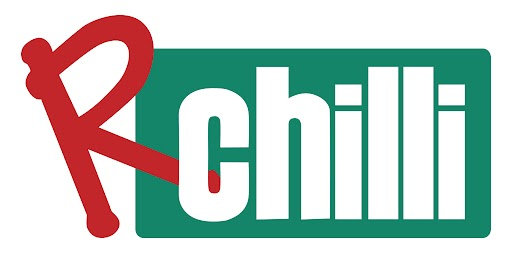

<div align="center">
  

  <h1>RChilli MCP Hub</h1>

  <p><strong>The HR Intelligence Layer for AI Agents</strong></p>

  <p>
    Connect AI agents to RChilli's enterprise-grade HR APIs with zero boilerplate.<br/>
    Parse resumes, analyse job descriptions, match candidates, enrich skills,<br/>
    redact bias fields, and convert documents — all through a single MCP server.
  </p>

  <p>
    <a href="https://smithery.ai/servers/dev-ko1g/rchilli">
      
    </a>
    &nbsp;
    
    &nbsp;
    
    &nbsp;
    
    &nbsp;
    
  </p>

  <p>
    <strong>MCP Endpoint:</strong>
    <code>https://mcp.rchilli.ai/mcp</code>
  </p>
</div>

---

## What is RChilli MCP Hub?

RChilli MCP Hub is a production-grade MCP server that exposes RChilli's full
HR data intelligence platform as **17 AI-callable tools** across 4 categories.

Built on **15+ years of HR data intelligence**, it is trusted by ATS vendors,
HR technology platforms, staffing agencies, and enterprise recruiting teams
worldwide. Every tool is **read-only** and returns a consistent, structured
JSON response — no raw exceptions, no inconsistent formats.

---

## ✨ Key Features

1. **Zero boilerplate** — One endpoint, one OAuth login, 17 tools ready to use
2. **OAuth 2.1 + PKCE** — No API keys to copy or paste; fully automatic auth flow
3. **200+ resume fields** — Name, contact, skills, experience, education, certifications, and taxonomy-enriched job profiles
4. **ONet / ESCO taxonomy** — 10,000+ curated skills and job profiles with canonical mappings
5. **Explainable matching** — Field-level evidence for every candidate-to-job score
6. **Bias redaction** — PII and bias field removal for fair-hiring workflows
7. **Document conversion** — PDF, DOCX, RTF, HTML — convert in any direction
8. **Auto-injected credentials** — `userkey` and `subuserid` injected from token; never pass them manually
9. **Consistent response envelope** — Every tool returns `{ success, data, meta }` with trace ID and latency

---

## 🎯 Use Cases

1. **Resume screening** — Parse and structure resumes for AI-powered shortlisting
2. **Job description analysis** — Extract required skills, experience range, and qualifications from any JD
3. **Candidate-to-job matching** — One-to-one fit scoring with field-level evidence, no indexing required
4. **Talent pool search** — Keyword search across your indexed resume database
5. **Skill gap analysis** — Identify what a candidate is missing for a specific role
6. **Bias-free hiring** — Redact names, photos, gender, and age before sharing with hiring managers
7. **Taxonomy enrichment** — Look up and autocomplete 10,000+ standardized skills and job titles
8. **Document standardization** — Convert and reformat candidate documents into consistent templates

---

## 🔐 Authentication

RChilli MCP Hub uses **OAuth 2.1 Authorization Code + PKCE (S256)** for
interactive clients and **OAuth 2.0 client_credentials** for server-to-server
integrations.

### Interactive flow (Claude, Cursor, Cline)

```
Your AI Client               MCP Server               RChilli Auth
─────────────────────   ───────────────────────   ──────────────────────
1. Discover config   →  /.well-known/
                         oauth-authorization-server
                         ← issuer, endpoints

2. Open login        →  GET /authorize
                         ← RChilli login page

3. User logs in      →  POST /authorize         →  validates credentials
                         ← 302 redirect + code      ← auth code

4. Exchange code     →  POST /token
   + PKCE verifier       ← Bearer token

5. Every tool call   →  Authorization: Bearer <token>
                         injects userkey + subuserid
                         → tool executes
```

**What this means for you:**
- The full OAuth flow opens automatically in a popup
- Access tokens refresh every **1 hour** silently
- Sessions stay active for **30 days** via refresh token

### Server-to-server (client_credentials)

```http
POST /token
Content-Type: application/x-www-form-urlencoded

grant_type=client_credentials&client_id=YOUR_ID&client_secret=YOUR_SECRET
```

Returns a Bearer token directly — no browser or user interaction needed.

---

## ⚡ Quick Connect

### Claude Desktop

Add to your `claude_desktop_config.json`:

```json
{
  "mcpServers": {
    "rchilli-mcp-hub": {
      "transport": "streamable-http",
      "url": "https://mcp.rchilli.ai/mcp"
    }
  }
}
```

### Claude.ai Connector

| Field | Value |
|-------|-------|
| Server URL | `https://mcp.rchilli.ai/mcp` |
| Client ID | Your RChilli Client ID |
| Client Secret | Your RChilli Client Secret |

### Cursor / Cline / VS Code

Set transport to **Streamable HTTP**, URL to `https://mcp.rchilli.ai/mcp`.
The OAuth popup opens on first connect and credentials are stored for reuse.

### 🔌 Other MCP Clients

#### Smithery

```bash
npm install -g smithery
smithery mcp add dev-ko1g/rchilli
```

Or browse the listing at:
https://smithery.ai/servers/dev-ko1g/rchilli

---

## 🛠️ Tools — 17 Total

`userkey` and `subuserid` are injected automatically from your Bearer token — you never need to pass them manually.

---

### 📄 Resume & Job Description Parsing (3 tools)

| Tool | What It Does |
|------|-------------|
| `parse_resume` | Extracts 200+ normalized fields — name, contact, skills, work history, education, certifications, and taxonomy-enriched job profile — from resume text. Use for plain text resumes. |
| `parse_resume_from_url` | Same deep extraction as `parse_resume` but fetches the file from a public URL. Supports PDF, DOCX, RTF, and 15+ formats. Use when the resume lives in cloud storage or an ATS link. |
| `parse_job_description` | Parses a job description into structured data — required and preferred skills, experience range, salary, qualifications, and taxonomy mappings. Use for job description text or files. |

---

### 🔍 Skills & Job Taxonomy (4 tools)

| Tool | What It Does |
|------|-------------|
| `lookup_skill` | Returns authoritative detail for any skill — definition, aliases, related skills, ontology, and ONet/ESCO codes. Grounds skill reasoning in a standardized taxonomy. |
| `lookup_job_profile` | Returns canonical detail for a role — required skills, career level, ontology, and ONet/ESCO mappings. Answers "what does this role need" from real taxonomy data. |
| `autocomplete_skill` | Returns skill name suggestions for a partial keyword across 10,000+ curated skills. Keeps free-text inputs aligned to the canonical taxonomy. |
| `autocomplete_job_profile` | Returns job profile suggestions for a partial keyword across 10,000+ curated job titles. Powers fast disambiguation and input alignment. |

---

### 🧹 Redaction, Documents & Utilities (7 tools)

| Tool | What It Does |
|------|-------------|
| `redact_resume` | Masks or removes bias and PII fields — name, photo, age, gender, contact — producing a blind version for sharing with hiring managers. Field selection is configurable. |
| `reformat_resume_with_template` | Restyles any resume into a branded template (TM001–TM006) and outputs PDF, DOCX, RTF, or HTML. Standardizes candidate presentation. |
| `convert_document_format` | Converts a resume document between formats — DOCX to PDF, RTF to HTML, and more — with optional face-image detection. |
| `extract_named_entities` | Tags named entities — job titles, skills, cities, degrees, organizations — with their positions from any free text. |
| `extract_contact_info` | Pulls contact details — name, email, phone, address, city, state, country, website — from unstructured text. |
| `geocode_locations` | Resolves latitude and longitude for one or more locations, or for locations inside parser output. Enables distance and radius logic. |
| `determine_job_zone` | Determines the O*NET Job Zone level (1–5) for a resume or JD. Useful for leveling candidates and gauging role seniority. |

---

### 🔎 Search & Matching (3 tools)

| Tool | What It Does |
|------|-------------|
| `score_resume_against_jd` | Produces an explainable one-to-one fit score between a resume and a JD with field-level evidence. No prior indexing required. |
| `find_matches_in_index` | Ranks an indexed corpus of resumes or JDs against a source document. Returns the best matches with scores for your talent pool. |
| `search_indexed_documents` | Runs a keyword search across your indexed resumes or JDs. Find candidates or roles by skill, title, or term. |

---

## 📦 Response Format

Every tool returns the same consistent envelope:

```json
{
  "success": true,
  "data": { },
  "meta": {
    "trace_id": "3e4f1a2b-uuid",
    "latency_ms": 312.45
  }
}
```

Errors return `success: false` with a structured `error` object:

```json
{
  "success": false,
  "error": {
    "code": "RCHILLI_API_ERROR",
    "message": "Invalid credentials",
    "retryable": false
  },
  "meta": {
    "trace_id": "3e4f1a2b-uuid",
    "latency_ms": 88.12
  }
}
```

`retryable: true` is set for rate-limit and transient errors so your
agent can automatically retry without human intervention.

---

## 🚀 Coming Soon

AI Agent tools — **Interview Question Generator**, **JD Generator**,
**Skill-Gap Analysis**, **Bias Detection**, and **Learning Path**.

---

## 🔑 Get Access

RChilli MCP Hub requires a valid RChilli account with an active plan.

| Resource | Link |
|----------|------|
| Sign up / Login | https://myaccount.rchilli.com/account/login |
| Plans & Pricing | https://docs.rchilli.com/kc/Plan_Subscription_and_cost |
| Documentation | https://docs.rchilli.com/kc/index.html |
| Help Desk | https://help.rchilli.com/hc/en-us |
| Smithery Listing | https://smithery.ai/servers/dev-ko1g/rchilli |
| Support | support@rchilli.com |


---

<div align="center">
  <sub>
    Built on 15+ years of HR data intelligence. Trusted by organizations worldwide.
    <br/>
    <a href="https://www.rchilli.com">rchilli.com</a>
    &nbsp;·&nbsp;
    <a href="https://mcp.rchilli.ai">mcp.rchilli.ai</a>
    &nbsp;·&nbsp;
    <a href="https://smithery.ai/servers/dev-ko1g/rchilli">Smithery</a>
  </sub>
</div>
